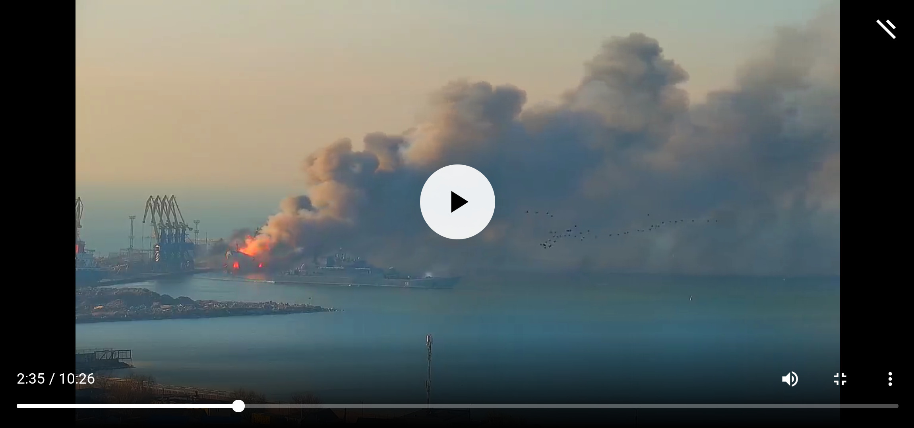

<h1 align="center">𝚆𝚎𝚕𝚌𝚘𝚖𝚎! Enjoy!</h1>

<h4 align="center"><em>Androids be more than computers!</em></h4>

Not a building, nor kinescope TV box,

Not a notebook, nor laptop,

It is a small shiny palm held thing.

When is <a href="https://github.com/buildAPKs">the holograph</a> going to sing?

<em>by SDRausty</em>

[USA liquid natural gas surplus](https://www.ecosia.org/search?q=USA+liquid+natural+gas+surplus)

[Does the EU buy natural gas from Russia?](https://www.ecosia.org/search?q=Does+EU+buy+natural+gas+from+Russia%3F)  Why?  Would you rather be a little cooler, or watch WW3 ignite?  Turn your gas heating off, please!

Before the war Ukrainian President Volodymyr Zelensky paid regular visits to the front line in eastern Ukraine

President Vladimir Putin has played too much with the button. He is crazy!
Президент Владимир Путин слишком много играл с кнопкой. Он сумасшедший!

https://user-images.githubusercontent.com/27742457/160233291-7c238232-8b5f-4acf-b013-f7f80496eabd.mp4

https://user-images.githubusercontent.com/27742457/160233370-9c30c8e0-41ba-4170-9c85-647b68b935ff.mp4

He wants his fuse to be lit for post World War III.
Он хочет, чтобы его фитиль загорелся для послезавтра Третьей мировой войны.

<!-- Reference https://github.com/YourUserAccount/YourProject/blob/master/DirectoryPath/ReadMe.md -->

THIS GITHUB ACCOUNT WAS ASKED BY TERMUX TO CRACK/ROOT THEIR ANDROID MACHINE MANY TIMES DURING YEARS WHEN WE WERE WORKING TOGETHER BY SOME THE CURRENT CURATORS OF TERMUX!

[I would like to know why Termux is asking for help, then bashes its' helpers by banning, deleting and minimizing contributor's work that Termux user's are seeking to use on their Android palmheld devices. How will Termux users find what they are seeking for when work contributed to Termux for Termux end users is gone?](https://github.com/termux/termux-packages/issues/202#issuecomment-1072656070)

[> Why not run POV-Ray on your Android?](https://github.com/termux/termux-packages/issues/202)

[My first comment in this issue answers op's request, and it is minimized now.  It seems that running `povray` was not possible on Android handheld until @koppi's request was answered by me.  Granted, the answer is a nonnative Termux answer, but I still cannot phantom why answering op's question is considered off topic spam now, but not in 2017.  This logic is mad:](https://github.com/termux/termux-packages/issues/202)

[It did not work = It works = SPAM = off topic](https://github.com/termux/termux-packages/issues/202)

[I felt that this topic is important enough to let upstream know too at https://github.com/POV-Ray/povray/issues/291, and it seems that upstream is not as eager to delete/minimize my hard effort/work with contributions as Termux curators are recently now.](https://github.com/termux/termux-packages/issues/202)  

[The SDRausty account is now banned for years at Termux Gitter.  I still do not know why;  Can you please unban the SDRausty account at Termux Gitter please?](https://github.com/termux/termux-packages/issues/202)

[> No, a package that works with glib in proot does not mean that it works with Termux/android.](https://github.com/termux/termux-packages/issues/202)

[The reason TermuxArch exists is because of Termux user requests.  Much of the work at TermuxArch is modifying the scripts without cracking/rooting Android.](https://github.com/termux/termux-packages/issues/202)

[> Pointing out that a package works in proot is off-topic in a package request issue like this one, so I disagree.](https://github.com/termux/termux-packages/issues/202)

[Does this answer imply that granting op's request via TermuxArch should NOT have been announced to the Termux community.  Please keep in mind that finding a working `povray` in Termux PRoot took much time for it did NOT work in almost all PRoot solution is NOT effortless either.  Finding a solution that works consistently and reliably requires very much effort and time.  Rooting Android devices to use Termux seems to make absolutely no sense at all as privileged apps can run Android!  Do you not agree @Grimler91?](https://github.com/termux/termux-packages/issues/202)

[> that the package in question was available from archlinux, which was frankly annoying ](https://github.com/termux/termux-packages/issues/202)

[I do not find the topic that it did not work, but now it works annoying at all.  Especially when it grants Termux user requests that seem to be met with applause except for Termux's applause and thanks, as in this topic here.](https://github.com/termux/termux-packages/issues/202)

[It is great that `povray` is finally available in native Termux.  Contributing to this issue, and at https://github.com/POV-Ray/povray/issues/291 took much time.  Finding a working `povray` solution took even more time and effort.  A thank you was not expected. Neither was a ban.](https://github.com/termux/termux-packages/issues/202#issuecomment-1072898610_)

[ >Pointing out that a package works in proot is off-topic](https://github.com/termux/termux-packages/issues/202#issuecomment-1072898610_)

[Trivializing precious hard work given to Termux is shamefull and finding my hard work that eventually led to povray's native integration minimized and deleted and more of this same behaviour at https://github.com/termux by Termux's curators while supurfulous topics are displayed up front, and in plain sight consuming time and detracting from the main topic, "does it work well on handheld without rooting Android?" only speaks of our team's integraty.  Do you agree?](https://github.com/termux/termux-packages/issues/202#issuecomment-1072898610_)

[Why are all my comments minimized in this issue, and all across the board at https://github.com/termux suddenly minimized?](https://github.com/termux/termux-app/issues/1242#issuecomment-1072940114_)

ANSWER: Were you asked to crack/break/root an Android smartphone via rooting an Android with a proprietary unknown source code Android APK by the current curators of Termux!?

THIS GITHUB ACCOUNT WAS ASKED BY TERMUX TO DO SO MANY TIMES DURING OUR YEARS WHEN WE WERE WORKING TOGETHER BY SOME THE CURRENT CURATORS OF TERMUX!

SHMEM+

[session0](https://wiki.termux.com/wiki/FAQ) [`wae.bash`](https://github.com/WAE/wae/blob/master/wae.bash)[`Chicago - 25 or 6 to 4 (Official Audio)-8A3HZvGN0qs.webm`](https://github.com/TermuxArch/TermuxArch/blob/master/archlinuxconfig.bash#L1884)

[session1](https://wiki.termux.com/wiki/Software) [`wae.bash`](https://github.com/WAE/wae/blob/master/wae.bash)[`Chicago\ Transit\ Authority\ Beginnings-pWd3BvRw4IU.mpv`](https://github.com/TermuxArch/TermuxArch/blob/master/archlinuxconfig.bash#L1884)

[session2](https://wiki.termux.com/wiki/PRoot) [`wae.bash`](https://github.com/WAE/wae/blob/master/wae.bash)[`Does\ Anybody\ Really\ Know\ What\ Time\ It\ Is-lzLbmOHTYcI.webm`](https://github.com/TermuxArch/TermuxArch/blob/master/archlinuxconfig.bash#L1884)

[session3](https://wiki.termux.com/wiki/User_Interface) [`wae.bash`](https://github.com/WAE/wae/blob/master/wae.bash)[`Saturday\ in\ the\ Park-vL7Op9ZQ3E0.webm`](https://github.com/TermuxArch/TermuxArch/blob/master/archlinuxconfig.bash#L1884)

[session4](https://wiki.termux.com/wiki/Working_with_APKs) [`wae.bash`](https://github.com/WAE/wae/blob/master/wae.bash)[`Sia\ -\ The\ Greatest-GKSRyLdjsPA.mpv`](https://github.com/TermuxArch/TermuxArch/blob/master/archlinuxconfig.bash#L1884) 🎵 🎶

CTRL+\ can be used to restart plays as desired.

Playing in the Snowscape, January 2022

[Service Duck](https://github.com/serviceanimals) Chester 2 and [Service Dog](https://github.com/serviceanimals) Princess Playing in the Snowscape, January 2022

Isaiah 11:6 <q>The wolf also shall dwell with the lamb, and the leopard shall lie down with the kid; and the calf and the young lion and the fatling together; and a little child shall lead them.</q>

Isaiah 11:7 <q>And the cow and the bear shall feed; their young ones shall lie down together: and the lion shall eat straw like the ox.</q>

Isaiah 11:8 <q>And the sucking child shall play on the hole of the asp, and the weaned child shall put his hand on the cockatrice' den.</q>

Isaiah 11:9 <q>They shall not hurt nor destroy in all my holy mountain: for the Earth shall be full of the knowledge of the LORD, as the waters cover the sea.</q>

[`mkdip`](https://github.com/TermuxArch/TermuxArch/blob/master/archlinuxconfig.bash#L230) [`~/serviceanimals/{dog,duck,rabbit,turkey}`](https://github.com/serviceanimals/)

[USA liquid natural gas surplus](https://www.ecosia.org/search?q=USA+liquid+natural+gas+surplus)

[Does the EU buy natural gas from Russia?](https://www.ecosia.org/search?q=Does+EU+buy+natural+gas+from+Russia%3F)  Why?  Would you rather be a little cooler, or watch WW3 ignite?  Turn your gas heating off, please!
<!-- SDRausty/README.md EOF -->
